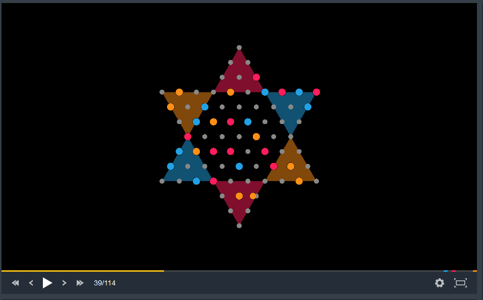

# Chinese checkers CodinGame

This project is an implementation of the chinese checkers board game for the CodeinGame plattform. You cannot play it yourself, but you can code an AI to play agains other AIs.

Game created using the [CodinGame SDK](https://www.codingame.com/playgrounds/25775).

The rules of the game are explained in [`config/statement_en.html`](config/statement_en.html).

## Build

Clone this project & download the Maven dependencies.
The CodinGame SDK only works with Java 8.

## Run

Launch `src/test/java/Main.java` to launch a local game.
